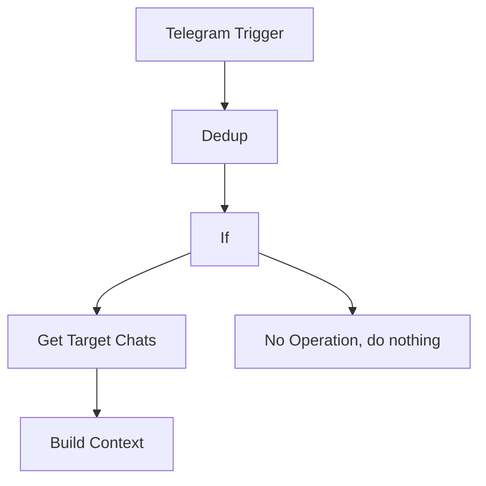

# 01 Source Listener

**Workflow ID:** 01

**File:**
`n8n/workflows/CNI - Source Listener.json`

**Version:**
MVP

**Status:**
Implemented

## Purpose

The `01 Source Listener` workflow receives Telegram messages, registers each source message in PostgreSQL to avoid duplicate processing, loads active target chats, and builds a JSON context for downstream distribution.

The workflow implementation is defined in `n8n/workflows/CNI - Source Listener.json`.

## Responsibilities

The workflow is responsible for:

- receiving Telegram messages
- preventing duplicate processing
- loading active target chats
- preparing a normalized message context

The workflow is NOT responsible for:

- publishing messages
- translation
- AI processing

## Interfaces

## Input Interface

Telegram Message

## Output Interface

Prepared Message Context

## Trigger

- Trigger type: Telegram Trigger (`n8n-nodes-base.telegramTrigger`)
- Event: `message`
- Input source: Telegram Bot API account configured as `Telegram account`

## System Context

```text
Telegram
   |
   v
01 Source Listener
   |
   v
Prepared Message Context
   |
   v
02 Message Distributor
```

## Workflow Diagram



## Processing Steps

## Telegram Trigger

Purpose:
Receives Telegram `message` updates from the configured Telegram Bot API account.

Input:
Telegram update payload containing a `message` object.

Output:
The received Telegram update JSON, including `message.chat.id`, `message.message_id`, and message content fields such as `message.text` when present.

## Dedup

Purpose:
Registers the source Telegram message in `processed_messages` and prevents duplicate processing through PostgreSQL conflict handling.

Input:
The Telegram update JSON from `Telegram Trigger`.

Output:
For a new message, returns `source_message_id` from the insert query. The node has `alwaysOutputData` enabled, so duplicate messages still produce an output item for the following `If` node.

## If

Purpose:
Checks whether the message was newly registered by testing whether `source_message_id` exists in the current JSON item.

Input:
The output from `Dedup`.

Output:
Routes newly registered messages to `Get Target Chats`. Routes duplicate messages to `No Operation, do nothing`.

## Get Target Chats

Purpose:
Loads active destination Telegram chats from PostgreSQL.

Input:
A newly registered message item from the true branch of `If`.

Output:
One item per active row returned by:

```sql
SELECT *
FROM target_chats
WHERE active = true
```

## No Operation, do nothing

Purpose:
Terminates processing for duplicate messages.

Input:
A duplicate message item from the false branch of `If`.

Output:
No transformed output. The workflow stops on this branch.

## Build Context

Purpose:
Builds the message context used by downstream distribution steps.

Input:
Active target chat rows from `Get Target Chats` and the original Telegram message read from `Telegram Trigger`.

Output:
A single JSON item containing the source message, source identifiers, target chats, and the unique language list derived from target chat configuration.

Output fields:

| Field | Description |
|-------|-------------|
| sourceMessage | Original text from the Telegram message. |
| sourceChatId | Telegram source chat ID. |
| sourceMessageId | Telegram source message ID. |
| targetChats | Active destination chats loaded from `target_chats`. |
| languages | Unique language list derived from active target chat configuration. |

## Database Usage

- `processed_messages`: Used by `Dedup` to insert `(source_chat_id, source_message_id)` with `ON CONFLICT DO NOTHING`. This prevents duplicate source messages from continuing through the main workflow path.
- `target_chats`: Used by `Get Target Chats` to load active target chats with `active = true`.

## Input Data

The workflow receives a Telegram update containing a `message` object. The current implementation reads:

- `message.chat.id` as the source chat ID.
- `message.message_id` as the source message ID.
- `message.text` as the source message text in `Build Context`.

## Output Data

For newly registered messages with active target chats, `Build Context` returns this JSON structure:

```json
{
  "sourceMessage": "string",
  "sourceMessageId": 0,
  "sourceChatId": 0,
  "targetChats": [],
  "languages": []
}
```

## Error Handling

Duplicate message:
The `Dedup` node uses `ON CONFLICT DO NOTHING`. If a message already exists in `processed_messages`, `source_message_id` is not returned and the `If` node routes the item to `No Operation, do nothing`.

Database failure:
The workflow has no custom database error handling. A PostgreSQL node failure follows the default n8n node error behavior.

No active target chats:
`Get Target Chats` returns no active chat rows. With no input rows for `Build Context`, the current workflow produces no prepared distribution context.

## Dependencies

Infrastructure:

- PostgreSQL

External APIs:

- Telegram Bot API

n8n Credentials:

- `Telegram account`
- `Postgres account`

## Assumptions

Current assumptions:

- Source message is text.
- Source message contains one language.
- Only active chats are loaded.
- Translation is disabled.

## Limitations

Current limitations:

- No media support.
- No albums.
- No captions.
- No edits.
- No deleted messages.

## Future Enhancements

Not included in MVP:

- Publishing messages to target chats.
- Message formatting per target chat.
- AI classification.
- Translation.
- Moderation.
- Scheduling.
